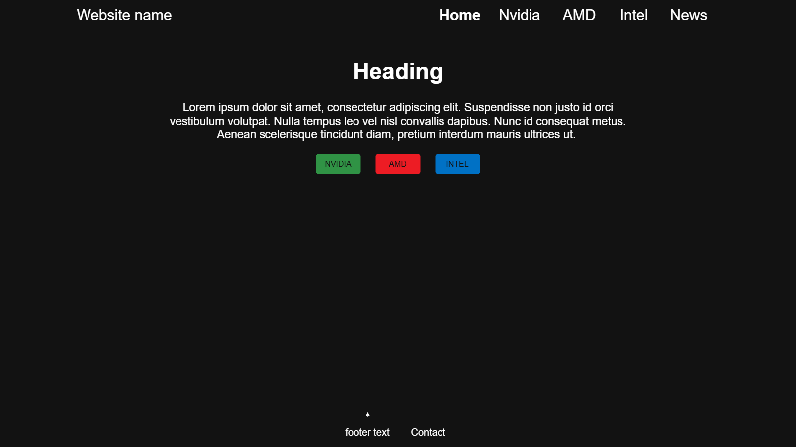
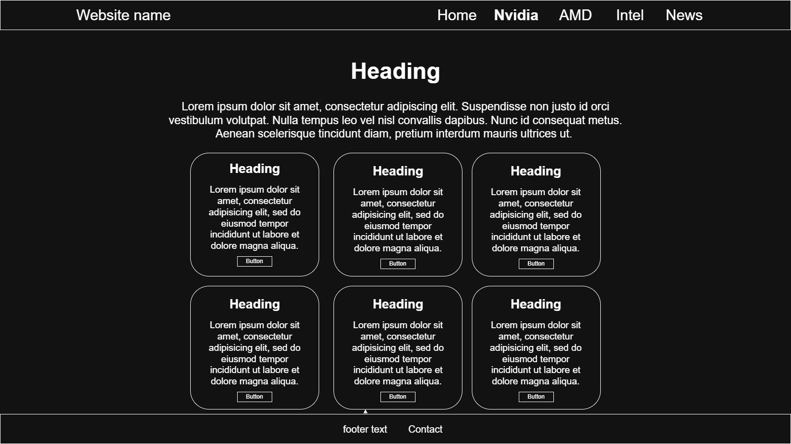
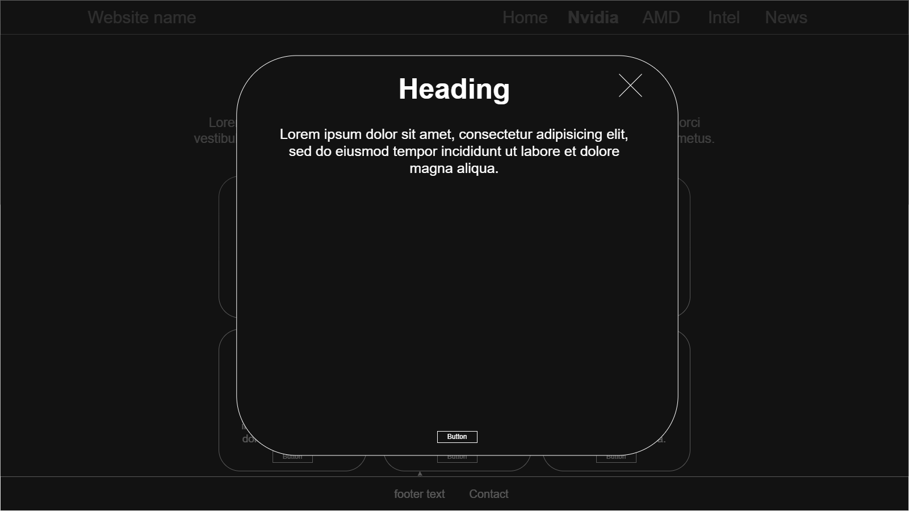
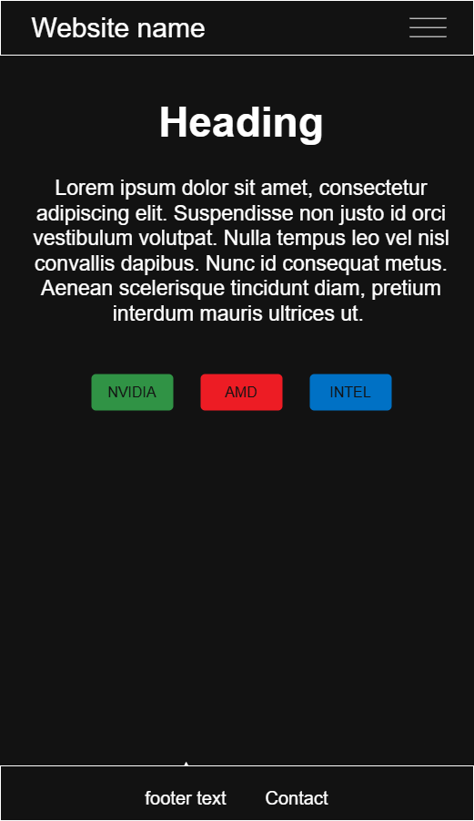
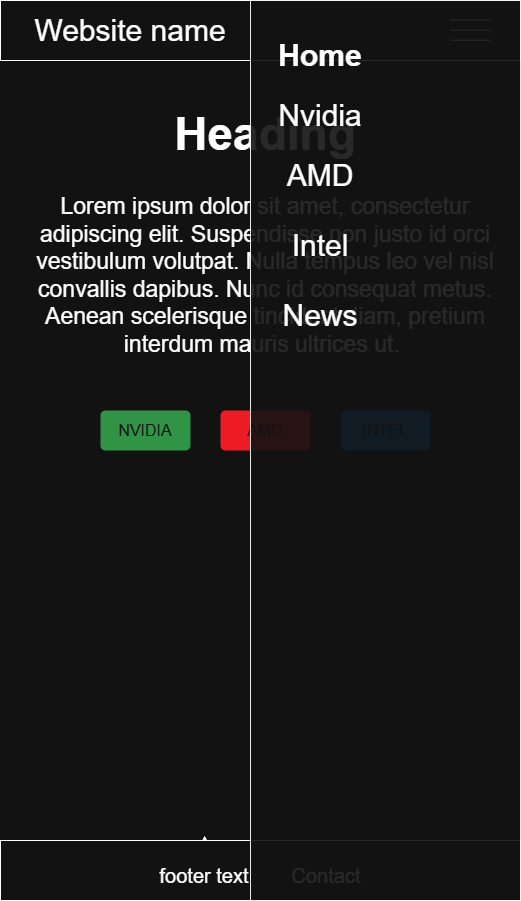

# Portfolio Purpose and Audience
The purpose of this portofolio is to share information about gaming GPUs. It should contain a breif history and specs of different GPU models from AMD, Nvidia, and Intel. It will also have a page with news.

The target audience are people all around the world that want to learn about GPUs. Having this in mind I will try and keep the design of the website simple because if you are looking to read you don't need fancy design that can distract you.

# Content Planning
The landing page will include a brief description of what a GPU is

Header section will include the name of the website with 5 links (this will be the main navigation that the website will use):
- first link will link to the landing page
- second link will link to the Nvidia page
- third link will link to the AMD page
- fourth link will link to the Intel Page
- fifth link will link to the News page

The main section will include a brief description about what a GPU is and 3 buttons that link to the other 3 pages

The footer section will include a copyright notice and contact information.

# Design Decisions

## How I applied the 4 design principles
- Contrast: 
- Repetition: I used a gradient that starts with the main color at the top and fades to almost black at the bottom
- Alignment: 
- Proximity:

## Color scheme:
Primary colors: Dark Purple

Secondary colors: Dark Red, Green and Blue

Background color: Red, Green and Blue gradient

Text color: #eee

I chose the dark purple as the main color because ...

I chose the red, green and blue colors because these are the colors that AMD, Nvidia, and Intel use as their primary colors. The colors will be a darker shade of red, green and blue to make the grey text readable.

## Typography
Heading font: 
Body text font:
Using web fonts from googleef
I chose this font because it is easly readable.

## Layout
### Overall structure: 
A simple layout with a header, main section and a footer.
- The header will have the name of the website and 5 links.
- The main section is the main content that be displayed on the page
- The footer will have a copyright notice and contact information.

### Content width:
I will use max width to prevent the main section from stretching more that 1000px

### Spacing:
Will have padding in the main section and use line height to make the more readable.

I chose this layout approach because it is simple. I didn't want the layout to distract the reader.

# Navigation Structure
The navigation will be located in the middle top of the page and contain 5 links: 

1. Home → index.html
2. Nvidia → nvidia.html 
3. AMD → amd.html
4. Intel → intel.html
5. News → news.html

The link text inside the navigation will be highlited in bold to indicate users on what page they are.

I chose this navigation layout because it is widely used and easy to understand and users can easly find what they need. 

## Site Map
```
Website Structure:
├── index.html (Home page)
├── pageNvidia.html (Nvidia page)
├── pageAMD.html (AMD information page)
├── pageIntel.html (Intel information page)
└── news.html (News related to GPUs)
```

## Wireframe sketches
### Desktop layout:



### Mobile layout:

#### Mobile menu layout:


## Wireframe annotations
Header and navigation:
- Inside the header is the name of the website the navigation bar for the website and centered in the middle of the page

Main content area:
- The main content is orgonized in a box that has a max width and is centered in the middle of the website

Footer area:
- The footer contains the copyright notice with contact information.

Responsive considerations:
- Inside the header only the name of the website will appear and it will be alligned to the left and to the right a burger menu to display the navigation links which will be alligned vertically across the screen
- The main section will no longer be a box and the contents will stack verically
- Footer contents will stack vertically

# Technologies and Tools
Text editor: [Visual Studio Code](https://code.visualstudio.com/)

Browser for testing: Chrome, Edge, Firefox, Brave

Version control: [Git and GitHub]

Wireframing tool: [draw.io](https://draw.io/)

Color selection tool: [Coolors](https://coolors.co/)

Google fonts: []()

Other tools: 

I chose these tools because they are widely used.

#  HTML Elements to Use
### **&lt;header&gt;**
Purpose: [What does this element do?]

How you’ll use it: [Specific use in your portfolio]

Why it’s appropriate: [Why is this the right semantic element for this purpose?]
### **&lt;nav&gt;**
### **&lt;main&gt;**
### **&lt;footer&gt;**


# CSS properties to be implemented:
### **Flexbox**
### **Grid**
### **color** property for text color
### **padding** property for padding inside of the boxes


# HTML and CSS Evolution
Somenthing here

# Implementation Plan